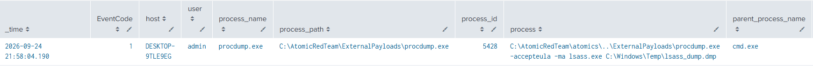
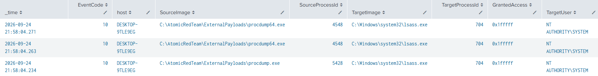
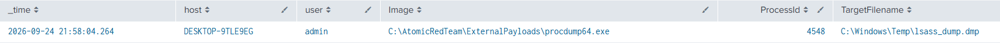

# Dump LSASS.exe Memory using ProcDump

**MITRE ATT&CK**: T1003.001 – OS Credential Dumping | Tactic: Credential access

## Intro
This test simulates credential dumping by accessing the memory of lsass.exe using Microsoft's Sysinternals ProcDump. ProcDump creates a full memory dump of LSASS and saves it as C:\Windows\Temp\lsass_dump.dmp. The dump can then potentially be analyzed offline to recover credential material. The test requires administrative privileges.

## Detection Queries & Evidence

1. Event ID 1: Sysmon procdump process Execution
```spl
  index=main
  source="XmlWinEventLog:Microsoft-Windows-Sysmon/Operational"
  EventCode=1
  (process_name="procdump.exe" OR process_path="*\\procdump.exe")
  | table _time EventCode host user process_name process_path process_id process parent_process_name parent_process_id
  | sort - _time
```
  


2. Event ID 10: LSASS.exe process accessed
```spl
  index=main
  source="XmlWinEventLog:Microsoft-Windows-Sysmon/Operational"
  EventCode=10
  TargetImage="*\\lsass.exe"
  | table _time EventCode host SourceImage SourceProcessId TargetImage TargetProcessId GrantedAccess TargetUser
  | sort - _time
```
  


3. Event ID 11: LSASS dmp file created
```spl
  index=main
  source="XmlWinEventLog:Microsoft-Windows-Sysmon/Operational"
  EventCode=11
  TargetFilename="*.dmp"
  | table _time host user Image ProcessId TargetFilename
  | sort - _time
```



## References
- MITRE ATT&CK: https://attack.mitre.org/tactics/TA0006/
- Atomic Red Team: https://www.atomicredteam.io/docs/atomics/T1003.001#atomic-test-1-dump-lsassexe-memory-using-procdump