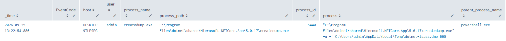
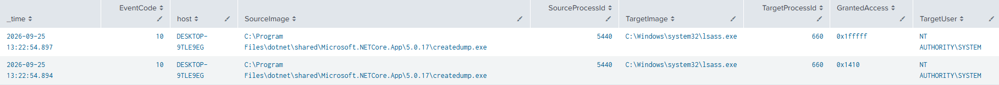
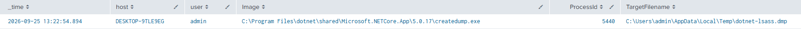

# Dump LSASS with createdump.exe from .NET 5

**MITRE ATT&CK**: T1003.001 – OS Credential Dumping | Tactic: Credential access

## Intro
This test uses the .NET 5 createdump.exe utility to create a memory dump of the live lsass.exe process. The Atomic Red Team test finds createdump.exe under the installed .NET 5 runtime, gets the LSASS PID, and writes the dump to: %TEMP%\dotnet-lsass.dmp

## Detection Queries & Evidence

1. Event ID 1: Sysmon createdump process Execution
```spl
  index=main
  source="XmlWinEventLog:Microsoft-Windows-Sysmon/Operational"
  EventCode=1
  process_name="createdump.exe"
  | table _time EventCode host user process_name process_path process_id process parent_process_name parent_process_path parent_process_id parent_process
  | sort - _time
```
  


2. Event ID 10: LSASS.exe process accessed
```spl
  index=main
  source="XmlWinEventLog:Microsoft-Windows-Sysmon/Operational"
  EventCode=10
  TargetImage="*\\lsass.exe"
  | table _time EventCode host SourceImage SourceProcessId TargetImage TargetProcessId GrantedAccess TargetUser
  | sort - _time
```
  


3. Event ID 11: LSASS dmp file created
```spl
  index=main
  source="XmlWinEventLog:Microsoft-Windows-Sysmon/Operational"
  EventCode=11
  TargetFilename="*.dmp"
  | table _time host user Image ProcessId TargetFilename
  | sort - _time
```



## References
- MITRE ATT&CK: https://attack.mitre.org/tactics/TA0006/
- Atomic Red Team: https://www.atomicredteam.io/docs/atomics/T1003.001#atomic-test-11-dump-lsass-with-createdumpexe-from-net-v5