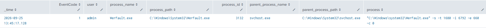
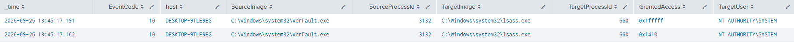
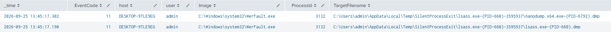
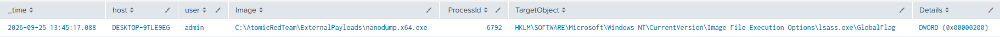

# Dump LSASS.exe Memory through Silent Process Exit

**MITRE ATT&CK**: T1003.001 – OS Credential Dumping | Tactic: Credential access

## Intro
This test abuses the Windows Silent Process Exit mechanism to make WerFault.exe (Windows Error Reporting) create a memory dump of lsass.exe. Unlike normal LSASS dumping, lsass.exe does not need to crash; the technique uses the Windows Error Reporting process to generate the dump.

## Detection Queries & Evidence

1. Event ID 1: Sysmon Werfault process Execution
```spl
  index=main
  source="XmlWinEventLog:Microsoft-Windows-Sysmon/Operational"
  EventCode=1
  process_name="werFault.exe"
  | table _time EventCode user process_name process_path process_id parent_process_name parent_process_path process
  | sort - _time
```
  


2. Event ID 10: LSASS.exe process accessed
```spl
  index=main
  source="XmlWinEventLog:Microsoft-Windows-Sysmon/Operational"
  EventCode=10
  TargetImage="*\\lsass.exe"
  | table _time EventCode host SourceImage SourceProcessId TargetImage TargetProcessId GrantedAccess TargetUser
  | sort - _time
```
  


3. Event ID 11: LSASS dmp file created
```spl
  index=main
  source="XmlWinEventLog:Microsoft-Windows-Sysmon/Operational"
  EventCode=11
  TargetFilename="*.dmp"
  | table _time EventCode host user Image ProcessId TargetFilename
  | sort - _time
```



4. Event ID 13: Image FIle Execution Options key modified
```spl
  index=main
  source="XmlWinEventLog:Microsoft-Windows-Sysmon/Operational"
  EventCode=13
  TargetObject="*\\Image File Execution Options\\lsass.exe\\GlobalFlag"
  | table _time host user Image ProcessId TargetObject Details
  | sort - _time
```



5. Event ID 12: Image FIle Execution Options key deleted
```spl
  index=main
  source="XmlWinEventLog:Microsoft-Windows-Sysmon/Operational"
  EventCode=12
  TargetObject="*\\Image File Execution Options\\lsass.exe"
  | table _time host user Image ProcessId EventType TargetObject
  | sort - _time
```


## References
- MITRE ATT&CK: https://attack.mitre.org/tactics/TA0006/
- Atomic Red Team: https://www.atomicredteam.io/docs/atomics/T1003.001#atomic-test-14-dump-lsassexe-memory-through-silent-process-exit
