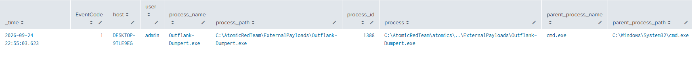
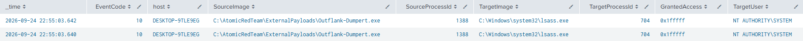
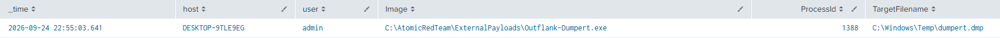

# Dump LSASS.exe Memory using direct system calls and API unhooking

**MITRE ATT&CK**: T1003.001 – OS Credential Dumping | Tactic: Credential access

## Intro
This test uses Dumpert to dump the memory of lsass.exe while attempting to evade security monitoring. Instead of relying on the normal Windows API path, Dumpert uses direct system calls and API unhooking, techniques intended to bypass user-mode security hooks. The resulting dump is written to C:\Windows\Temp\dumpert.dmp.

## Detection Queries & Evidence

1. Event ID 1: Sysmon Dumpert process Execution
```spl
  index=main
  source="XmlWinEventLog:Microsoft-Windows-Sysmon/Operational"
  EventCode=1
  (process_name="*Dumpert*" OR process_path="*Dumpert*")
  | table _time EventCode host user process_name process_path process_id process parent_process_name parent_process_path parent_process_id parent_process
  | sort - _time
```
  


2. Event ID 10: LSASS.exe process accessed
```spl
  index=main
  source="XmlWinEventLog:Microsoft-Windows-Sysmon/Operational"
  EventCode=10
  TargetImage="*\\lsass.exe"
  | table _time EventCode host SourceImage SourceProcessId TargetImage TargetProcessId GrantedAccess TargetUser
  | sort - _time
```
  


3. Event ID 11: LSASS dmp file created
```spl
  index=main
  source="XmlWinEventLog:Microsoft-Windows-Sysmon/Operational"
  EventCode=11
  TargetFilename="*.dmp"
  | table _time host user Image ProcessId TargetFilename
  | sort - _time
```



## References
- MITRE ATT&CK: https://attack.mitre.org/tactics/TA0006/
- Atomic Red Team: https://www.atomicredteam.io/docs/atomics/T1003.001#atomic-test-3-dump-lsassexe-memory-using-direct-system-calls-and-api-unhooking