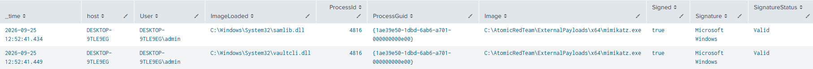
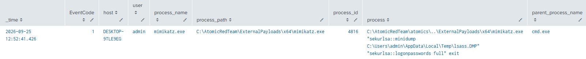

# Offline Credential Theft With Mimikatz

**MITRE ATT&CK**: T1003.001 – OS Credential Dumping | Tactic: Credential access

## Intro
This test uses Mimikatz to extract credential information from an existing LSASS memory dump (lsass.DMP). It does not dump LSASS itself; it loads the dump with sekurlsa::minidump and attempts credential extraction with sekurlsa::logonpasswords.

## Detection Queries & Evidence

1. Event ID 1: Sysmon mimicatz process Execution
```spl
  index=main
  source="XmlWinEventLog:Microsoft-Windows-Sysmon/Operational"
  EventCode=1
  process_name="mimikatz.exe"
  | search process="*sekurlsa::minidump*" OR process="*sekurlsa::logonpasswords*"
  | table _time EventCode host user process_name process_path process_id process parent_process_name parent_process_path parent_process_id parent_process
  | sort - _time
```
  


2. Event ID 7: mimikatz.exe loaded .dlls
```spl
  index=main
  source="XmlWinEventLog:Microsoft-Windows-Sysmon/Operational"
  EventCode=7
  (ImageLoaded="*\\samlib.dll" OR ImageLoaded="*\\vaultcli.dll")
  | table _time host User ImageLoaded ProcessId ProcessGuid Image Signed Signature SignatureStatus 
  | sort _time
```
  


## References
- MITRE ATT&CK: https://attack.mitre.org/tactics/TA0006/
- Atomic Red Team: https://www.atomicredteam.io/docs/atomics/T1003.001#atomic-test-6-offline-credential-theft-with-mimikatz

