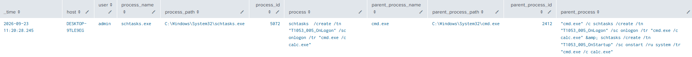
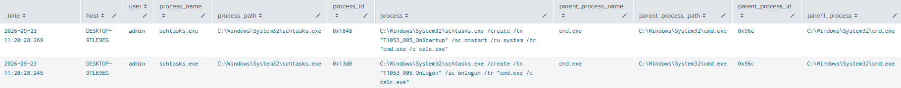
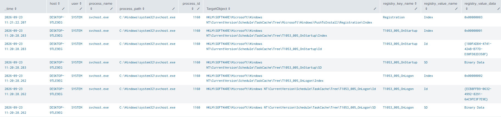
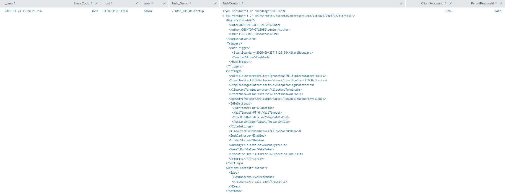

# Scheduled Task Startup Script Detection

**MITRE ATT&CK**: T1053.005 – Scheduled Task/Job | Tactic: Persistence

## Intro
This test demonstrates abuse of Windows Task Scheduler for execution at user logon and system startup. The test creates two scheduled tasks using schtasks.exe: one triggered at logon and another triggered at system startup. Both tasks launch cmd.exe /c calc.exe.


## Detection Queries & Evidence

1. Event ID 1: Sysmon schtasks Command Execution
```spl
  index=main 
  source="XmlWinEventLog:Microsoft-Windows-Sysmon/Operational" 
  EventCode=1 
  process_name="schtasks.exe"
  | table _time EventCode host user process_name process_path process_id process parent_process_name parent_process_path parent_process_id parent_process
  | sort - _time
```
  


2. Event ID 4688: Windows schtasks Command Execution
```spl
  index=main 
  EventCode=4688 
  source="WinEventLog:Security"
  | search process_path="C:\\Windows\\System32\\schtasks.exe"
  | table _time EventCode host user process_name process_path process_id process parent_process_name parent_process_path parent_process_id parent_process
  | sort - _time
```
  


3. Event ID 13: Sysmon Scheduled Task Registry Modification
```spl
  index=main 
  source="XmlWinEventLog:Microsoft-Windows-Sysmon/Operational"
  EventCode=13
  TargetObject="HKLM\\SOFTWARE\\Microsoft\\Windows NT\\CurrentVersion\\Schedule\\TaskCache\\*"
  | table _time EventCode host user process_name process_path process_id TargetObject registry_key_name registry_value_name registry_value_data
  | sort - _time
```



4. Event ID 4698: Windows Scheduled Task Creation
```spl
  index=main 
  EventCode=4698 
  source="WinEventLog:Security"
  | table _time EventCode host user Task_Name TaskContent ClientProcessId ParentProcessId
  | sort - _time
```
  

## References
- MITRE ATT&CK: https://attack.mitre.org/techniques/T1053/005/
- Atomic Red Team: https://www.atomicredteam.io/docs/atomics/T1053.005#atomic-test-1-scheduled-task-startup-script