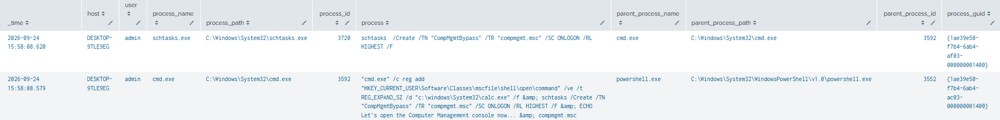
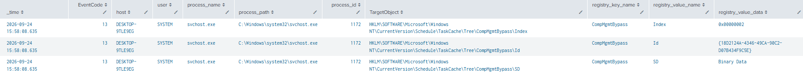
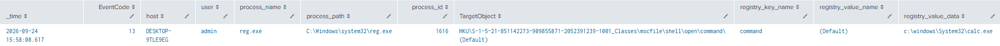
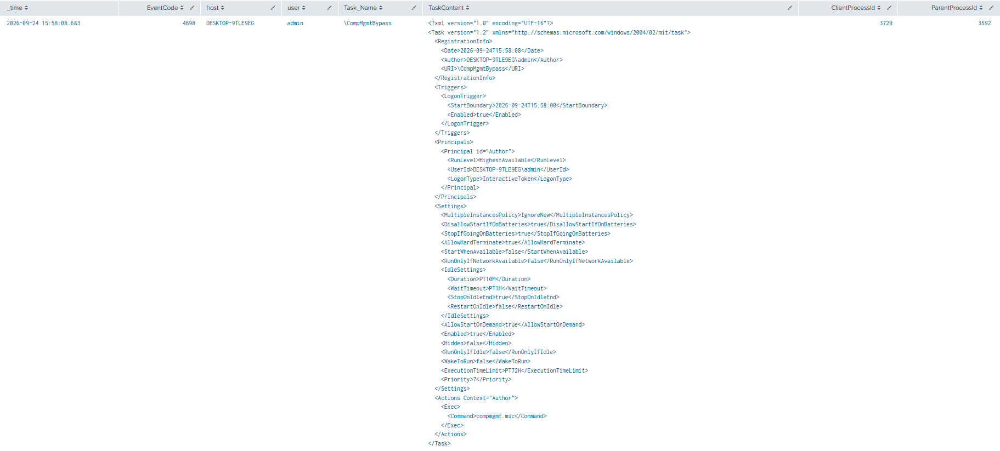

# Scheduled Task Persistence via CompMgmt.msc

**MITRE ATT&CK**: T1053.005 – Scheduled Task/Job | Tactic: Persistence

## Intro
This lab demonstrates how an attacker can abuse Windows Scheduled Tasks for persistence by combining a scheduled task with an .msc file-handler registry hijack. The test modifies the mscfile registry handler to execute a payload, then creates an ONLOGON scheduled task that launches compmgmt.msc (Computer Management). When the task runs, the modified handler causes the payload to execute.

## Detection Queries & Evidence

1. Event ID 1: Sysmon schtasks Command Execution
```spl
  index=main
  EventCode=1
  process_name IN ("powershell.exe","cmd.exe","schtasks.exe")
  (process="*/create*" AND process="*schtasks*")
  | table _time host user process_name process_path process_id process parent_process_name parent_process_path parent_process_id process_guid
  | sort - _time
```
  


2. Event ID 13: Sysmon Scheduled Task Registry Modification
```spl
  index=main 
  source="XmlWinEventLog:Microsoft-Windows-Sysmon/Operational"
  EventCode=13
  TargetObject="HKLM\\SOFTWARE\\Microsoft\\Windows NT\\CurrentVersion\\Schedule\\TaskCache\\*"
  | table _time EventCode host user process_name process_path process_id TargetObject registry_key_name registry_value_name registry_value_data
  | sort - _time
```


3. Event ID 13: Sysmon MSC File Handler Registry Modification
```spl
  index=main 
  source="XmlWinEventLog:Microsoft-Windows-Sysmon/Operational"
  EventCode=13
  process_name="reg.exe"
  TargetObject="*\mscfile\\shell\\open\\command*"
  | table _time EventCode host user process_name process_path process_id TargetObject registry_key_name registry_value_name registry_value_data
  | sort - _time
```


4. Event ID 4698: Windows Scheduled Task Creation
```spl
  index=main 
  EventCode=4698 
  source="WinEventLog:Security"
  | table _time EventCode host user Task_Name TaskContent ClientProcessId ParentProcessId
  | sort - _time
```
  


## References
- MITRE ATT&CK: https://attack.mitre.org/techniques/T1053/005/
- Atomic Red Team: https://www.atomicredteam.io/docs/atomics/T1053.005#atomic-test-11-scheduled-task-persistence-via-compmgmtmsc


