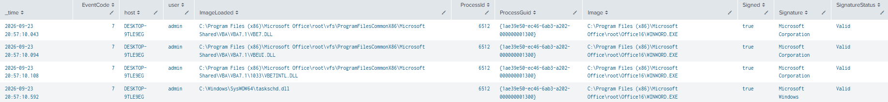
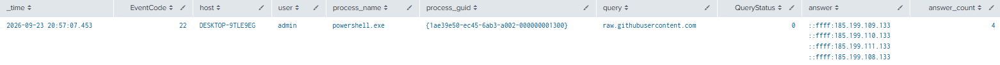
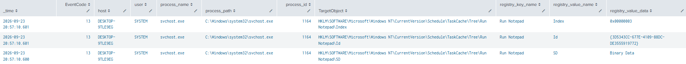
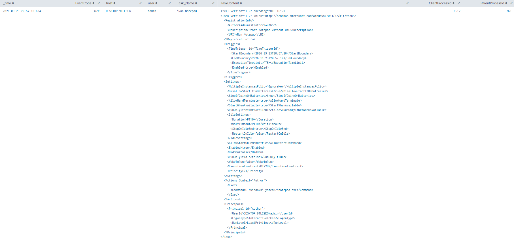

# Task Scheduler via VBA

**MITRE ATT&CK**: T1053.005 – Scheduled Task/Job | Tactic: Persistence

## Intro
This test demonstrates abuse of Windows Task Scheduler through VBA and the Windows API. The test uses a Microsoft Office macro to create a scheduled task named Run Notepad, which executes notepad.exe approximately 30–40 seconds after the module runs.


## Detection Queries & Evidence

1. Event ID 7: Sysmon suspicious dll loaded
```spl
  index=main 
  source="XmlWinEventLog:Microsoft-Windows-Sysmon/Operational"
  EventCode=7
  Image="*WINWORD.EXE"
  (ImageLoaded="*vbe*.dll" OR ImageLoaded="*taskschd.dll")
  | table _time host User ImageLoaded ProcessId ProcessGuid Image Signed Signature SignatureStatus 
  | sort _time
```
  


2. Event ID 22: Suspicious DNS query
```spl
  index=main
  source="XmlWinEventLog:Microsoft-Windows-Sysmon/Operational"
  EventCode=22
  process_name="powershell.exe"
  query="raw.githubusercontent.com"
  | table _time EventCode host user process_name process_id process_guid query QueryResults QueryStatus answer answer_count record_type reply_code_id
  | sort - _time
```
  


3. Event ID 13: Sysmon Scheduled Task Registry Modification
```spl
  index=main 
  source="XmlWinEventLog:Microsoft-Windows-Sysmon/Operational"
  EventCode=13
  TargetObject="HKLM\\SOFTWARE\\Microsoft\\Windows NT\\CurrentVersion\\Schedule\\TaskCache\\*"
  | table _time EventCode host user process_name process_path process_id TargetObject registry_key_name registry_value_name registry_value_data
  | sort - _time
```



4. Event ID 4698: Windows Scheduled Task Creation
```spl
  index=main 
  EventCode=4698 
  source="WinEventLog:Security"
  | table _time EventCode host user Task_Name TaskContent ClientProcessId ParentProcessId
  | sort - _time
```
  

## References
- MITRE ATT&CK: https://attack.mitre.org/techniques/T1053/005/
- Atomic Red Team: https://www.atomicredteam.io/docs/atomics/T1053.005#atomic-test-5-task-scheduler-via-vba