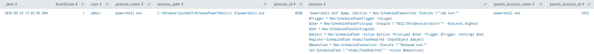
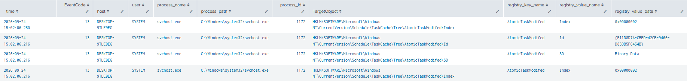
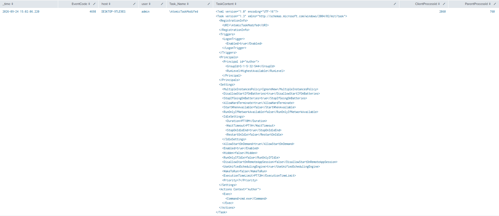

# PowerShell Modify A Scheduled Task

**MITRE ATT&CK**: T1053.005 – Scheduled Task/Job | Tactic: Persistence

## Intro
This test demonstrates modification of an already registered Windows scheduled task. It first creates a task that launches cmd.exe, then changes that task's action so it launches notepad.exe instead. The Atomic Red Team documentation states that PowerShell performs both the initial registration and subsequent modification.


## Detection Queries & Evidence

1. Event ID 1: Sysmon schtasks Command Execution
```spl
  index=main
  EventCode=1
  process_name="powershell.exe"
  (process="*Register-ScheduledTask*" OR process="*Set-ScheduledTask*")
  | table _time host user process_name process_path process_id process parent_process_name parent_process_path parent_process_id process_guid
  | sort - _time
```
  


2. Event ID 13: Sysmon Scheduled Task Registry Modification
```spl
  index=main 
  source="XmlWinEventLog:Microsoft-Windows-Sysmon/Operational"
  EventCode=13
  TargetObject="HKLM\\SOFTWARE\\Microsoft\\Windows NT\\CurrentVersion\\Schedule\\TaskCache\\*"
  | table _time EventCode host user process_name process_path process_id TargetObject registry_key_name registry_value_name registry_value_data
  | sort - _time
```



3. Event ID 4698: Windows Scheduled Task Creation
```spl
  index=main 
  EventCode=4698 
  source="WinEventLog:Security"
  | table _time EventCode host user Task_Name TaskContent ClientProcessId ParentProcessId
  | sort - _time
```
  


4. Event ID 4702: Windows Scheduled Task Modified
```spl
  index=main
  source="WinEventLog:Security"
  EventCode=4702
  | table _time EventCode host user Task_Name TaskNewContent ClientProcessId ParentProcessId
  | sort - _time
```
  

## References
- MITRE ATT&CK: https://attack.mitre.org/techniques/T1053/005/
- Atomic Red Team: https://www.atomicredteam.io/docs/atomics/T1053.005#atomic-test-9-powershell-modify-a-scheduled-task

